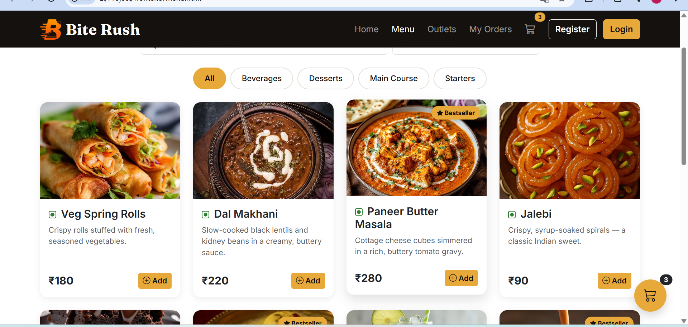
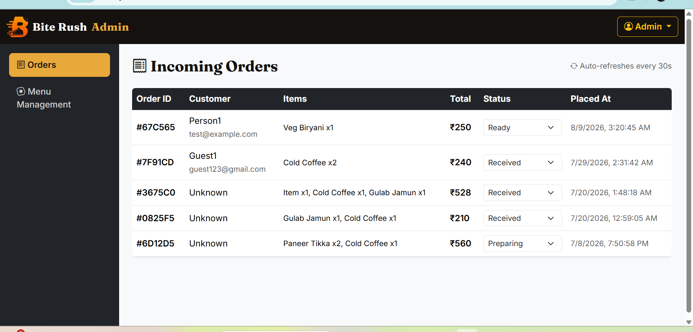
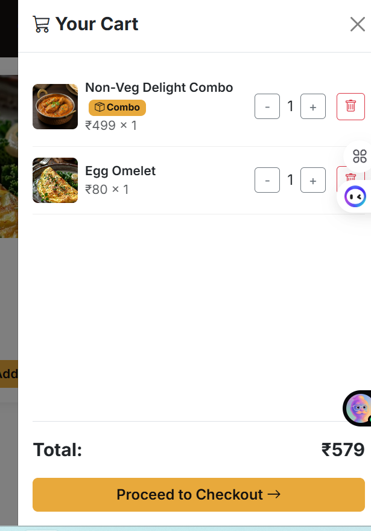
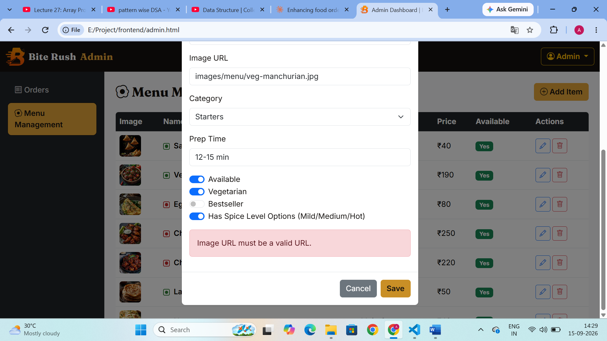
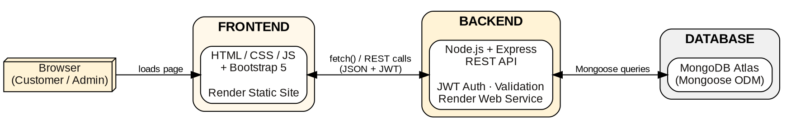
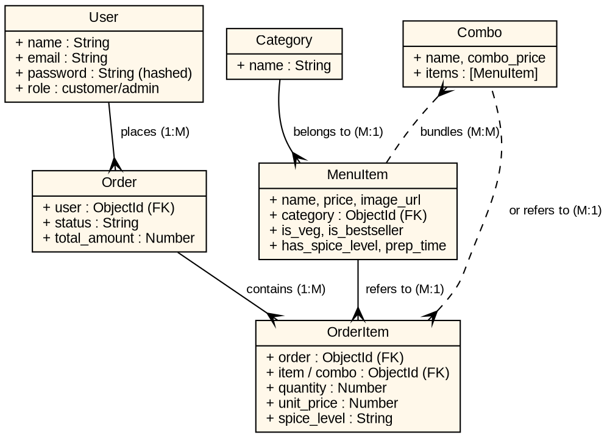

<p align="center">
  
</p>

<p align="center">
  <b>A full-stack, production-deployed online food ordering platform — browse a live menu, build a cart,<br>
  checkout with server-validated pricing, and track your order in real time.</b>
</p>

<p align="center">
  <a href="https://bite-rush-frontend.onrender.com"></a>
  <a href="https://bite-rush-api.onrender.com/api/health"></a>
</p>

<p align="center">
  
  
  
  
  
  
</p>

> Note: hosted on Render's free tier — the backend may take 30–50 seconds to "wake up" if it hasn't been used recently.

---

## 📑 Contents

[Why I built it](#-why-i-built-it) · [Highlights](#-highlights) · [Screenshots](#-screenshots) · [Architecture](#️-architecture) · [Data Model](#-data-model) · [Security](#️-security) · [Tech Stack](#️-tech-stack) · [Project Structure](#-project-structure) · [Getting Started](#-getting-started-local-development) · [API Reference](#-api-reference) · [Roadmap](#️-roadmap)

---

## 💡 Why I built it

Every food-ordering project I'd seen followed the same shape: a menu, a cart, an order. I wanted to build something that actually felt like it could run a real outlet — not just a CRUD demo with a cart bolted on.

So Bite Rush became an exercise in building things **the way a production app would need them**, even for a solo college project: prices are recalculated and validated on the server at checkout, not trusted from the browser; every destructive or privileged action checks ownership and role server-side, not just hidden in the UI; and the database schema is normalized so a menu price change can never silently rewrite the total of an order someone already paid for.

**I kept iterating on it long after the "minimum" feature set was done** — adding item customization, combo bundles, order cancellation — because the goal was never to finish a checklist, it was to build something that behaves correctly under real use.

---

## ✨ Highlights

| 🛒 Full ordering flow<br>Category-filtered **live menu**, a persistent **cart** (localStorage, survives refresh), **quantity steppers** right on the menu card, and a full **checkout** flow with order confirmation. | 🌶️ Per-dish customization<br>Items can be marked with a **spice level picker** (Mild / Medium / Hot) in a detail modal — opt-in per dish, validated server-side so only dishes that support it can carry a spice choice into an order. |
| --- | --- |
| 🍱 **Combo meals**<br>Admin-built bundles of existing menu items at a discounted price, with the **savings auto-computed** from the live prices of the items inside — never a stale, hand-typed number. | 📦 **Order lifecycle**<br>Received → Preparing → Ready → Delivered, with a live **status tracker**. Customers can **cancel** their own order while it's still queued, and **reorder** a past order in one click. |
| 🔐 **Server-validated pricing**<br>Every order total is recalculated from the database at checkout — the price a client sends is never trusted, closing the most common e-commerce tampering vector. | 🛡️ **Role-based admin dashboard**<br>A separate, protected dashboard for menu CRUD, live incoming orders (auto-refreshing), and combo management — completely inaccessible to non-admin accounts, enforced on the API itself. |
| 🖼️ **Self-hosted images**<br>Dish photos live in the project's own `images/` folder, not hot-linked from a third party — so the menu never breaks if an external image host changes or removes a file. | ✅ **Defensive input validation**<br>Every write endpoint runs through `express-validator` server-side — registration, login, menu changes, and order placement all reject malformed input before it ever reaches the database. |

---

## 📸 Screenshots

<p align="center"><i>Screenshots are from the live app, with real seeded menu data.</i></p>

| Menu — live search, sort, spice/veg indicators | Admin — live incoming orders |
|---|---|
|  |  |

| Cart — regular items + a combo bundle | Admin — building a combo |
|---|---|
|  |  |

---

## 🏗️ Architecture

Bite Rush follows a clean, fully decoupled 3-tier architecture — a static frontend, a stateless REST API, and a managed cloud database — talking entirely over JSON + JWT.

<p align="center">
  
</p>

```
frontend/            → Static HTML/CSS/JS client (Render Static Site)
  ├── index.html, menu.html, outlets.html, order.html, admin.html, login.html, register.html
  ├── css/style.css   → Design tokens, hero/menu/admin/auth styling
  └── js/             → One concern per file (cart, auth, menu, order, admin, combo-aware checkout)

backend/
  ├── config/         → Database connection
  ├── models/         → Mongoose schemas (User, Category, MenuItem, Combo, Order, OrderItem)
  ├── controllers/     → Business logic per module
  ├── routes/          → Express route definitions
  ├── middleware/       → JWT auth, role-based access control, validation error handling
  ├── validators/       → express-validator rule sets per module
  └── server.js         → App entry point
```

### Data Model

<p align="center">
  
</p>

- **User** → places many **Orders**
- **Order** → contains many **OrderItems**
- **OrderItem** → refers to **either** a `MenuItem` **or** a `Combo` (never both), and snapshots `unit_price` + an optional `spice_level` at the moment of purchase — so a later menu price change, or deleting a combo, can never alter a historical order's total
- **MenuItem** → belongs to a **Category**, optionally flagged `has_spice_level`
- **Combo** → bundles multiple **MenuItems**; its "you save ₹X" badge is computed live from their current prices, never hand-entered

---

## 🛡️ Security

| Layer | What it does |
|---|---|
| **Password hashing** | bcrypt, salted — plaintext passwords are never stored, ever. |
| **JWT auth** | Stateless `Authorization: Bearer` tokens carrying user id + role; verified server-side on every protected route via middleware. |
| **Role-based access control** | `adminOnly` middleware rejects non-admin tokens on every admin route — menu CRUD, order status updates, combo management — at the API layer, not just hidden UI. |
| **Ownership checks** | Cancelling an order verifies the order belongs to the requesting user server-side — a customer can't cancel (or even see) someone else's order by guessing an id. |
| **Server-side price validation** | Checkout recalculates every line item's price from the current database record; a tampered client-side price is simply ignored. |
| **Input validation** | `express-validator` rule sets on every write endpoint (auth, menu, orders, combos) reject malformed or out-of-range input before it reaches a controller. |
| **Secrets management** | `JWT_SECRET` and `MONGO_URI` live only in environment variables (`.env`, Render env vars) — never committed; `.env` is git-ignored from day one. |

---

## 🛠️ Tech Stack

| Layer | Choice | Why |
|---|---|---|
| Frontend | HTML5, CSS3, Vanilla JavaScript, Bootstrap 5 | No framework overhead for a project this size — every line is mine to explain, and Bootstrap's grid/components keep the UI consistent without hand-rolling layout CSS. |
| Backend | Node.js, Express.js | A minimal, unopinionated REST framework — lets the whole stack (frontend + backend) stay in one language, JavaScript. |
| Database | MongoDB Atlas (Mongoose ODM) | Document model fits a menu/order system whose schema kept evolving (spice levels, combos, prep time) without needing a migration every time. |
| Auth | JWT + bcrypt.js | Stateless sessions that scale horizontally with no server-side session store; bcrypt is the industry-standard slow hash for passwords. |
| Validation | express-validator | Declarative, centralized validation rules instead of scattered manual `if` checks in every controller. |
| Deployment | Render (Web Service + Static Site) | Free tier, automatic redeploys on every push to `main`, zero server management. |
| Tooling | Git, GitHub, Postman | Version control and manual API testing throughout development. |

---

## 📁 Project Structure

```
bite-rush/
├── backend/
│   ├── config/db.js
│   ├── controllers/      # authController, categoryController, menuController, orderController, comboController
│   ├── models/            # User, Category, MenuItem, Combo, Order, OrderItem
│   ├── routes/             # authRoutes, categoryRoutes, menuRoutes, orderRoutes, comboRoutes
│   ├── middleware/          # authMiddleware (protect, adminOnly), validate (handleValidationErrors)
│   ├── validators/           # authValidators, menuValidators, orderValidators, comboValidators
│   └── server.js
├── frontend/
│   ├── index.html, menu.html, outlets.html, order.html
│   ├── admin.html, login.html, register.html
│   ├── images/menu/            # self-hosted dish photos
│   ├── css/style.css
│   └── js/
│       ├── config.js, auth.js, cart.js, toast.js, validation.js
│       ├── menu.js, homepage.js, outlets.js, outlet-data.js, order.js
│       └── admin.js
└── docs/                        # README images (banner, screenshots, diagrams)
```

---

## 🚀 Getting Started (Local Development)

### Prerequisites

- Node.js (v18+)
- A free [MongoDB Atlas](https://www.mongodb.com/cloud/atlas) cluster

### 1. Clone the repo

```bash
git clone https://github.com/Ajitabhjha13/bite-rush.git
cd bite-rush
```

### 2. Set up the backend

```bash
cd backend
npm install
```

Create a `.env` file in `backend/` (see `.env.example`):

```
PORT=5000
MONGO_URI=your_mongodb_connection_string
JWT_SECRET=your_long_random_secret
```

Run the server:

```bash
npm run dev
```

### 3. Run the frontend

Open `frontend/index.html` directly in your browser, or serve the `frontend/` folder with any static file server (e.g. VS Code's Live Server).

---

## 📡 API Reference

| Method | Endpoint | Access | Description |
|---|---|---|---|
| POST | `/api/auth/register` | Public | Register a new user |
| POST | `/api/auth/login` | Public | Log in, receive a JWT |
| GET | `/api/categories` | Public | List all categories |
| GET | `/api/menu` | Public | List all available menu items |
| GET | `/api/menu/category/:id` | Public | Filter menu items by category |
| GET | `/api/combos` | Public | List all available combo meals (with live savings) |
| POST | `/api/orders` | Customer | Place a new order (items and/or combos) |
| GET | `/api/orders/my` | Customer | Get logged-in user's order history |
| PUT | `/api/orders/:id/cancel` | Customer | Cancel your own order (only while status = Received) |
| GET | `/api/menu/admin/all` | Admin | List all menu items (incl. unavailable) |
| POST / PUT / DELETE | `/api/menu/admin/...` | Admin | Menu item CRUD |
| POST / PUT / DELETE | `/api/combos/admin/...` | Admin | Combo CRUD |
| GET | `/api/orders/admin/all` | Admin | View all orders |
| PUT | `/api/orders/admin/:id/status` | Admin | Update an order's status |

All protected routes require an `Authorization: Bearer <token>` header.

---

## 🗺️ Roadmap

- [x] Core ordering flow — menu, cart, checkout, order tracking
- [x] JWT auth with role-based admin dashboard
- [x] Server-side price validation at checkout
- [x] Item detail modal with spice-level customization
- [x] Combo meals with auto-computed savings
- [x] Order cancellation
- [x] Self-hosted dish images
- [ ] Pagination on admin orders/menu tables
- [ ] Automated tests (Jest + Supertest)
- [ ] Payment gateway integration (Razorpay)
- [ ] Real-time order notifications via WebSockets
- [ ] Multi-restaurant support
- [ ] React Native mobile app using the existing REST API

---

## 📄 License

This project was built as an academic project for the B.Tech CSE curriculum at Parul University.

---

<p align="center">
<b>Built by <a href="https://github.com/Ajitabhjha13">Ajitabh Kumar Jha</a></b><br>
CSE · Parul University · Vadodara, Gujarat
</p>

<p align="center">
  <a href="https://github.com/Ajitabhjha13"></a>
</p>
